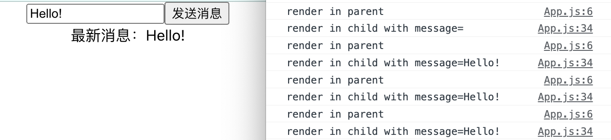

# React 模式之纯组件

## 什么是纯组件

纯组件(Pure Component)这概念衍生自[纯函数](https://en.wikipedia.org/wiki/Pure_function)。纯函数指的是返回结果只依赖于传入的参数，且对函数作用域外没有副作用的函数。这种函数在相同参数下，返回结果是不变的。纯函数的返回值能被安全地缓存起来，在下次调用时，跳过函数执行，直接读取缓存。因为函数没有外部副作用，不执行函数对整个程序没有影响。

与纯函数类似，如果一个组件**在 props 和 state 相同的情况下，每次 render 的结果都是相同的**，那这个组件就是纯组件。也就是说，纯组件的 render 结果只依赖于 props 和 state，如果两次渲染中，props 和 state 是相同的，那它们的 render 结果也是一样的。

## 纯组件解决了什么问题

在理解纯组件有什么用处之前，先来看一下 React 如何更新组件。

React 在更新组件时，会从触发组件开始，递归地调用整颗子树的 render 函数，构建新的虚拟树。即使子组件的 props 和 state 没有变化，render 函数还是会被执行。

看这个例子:

```jsx
const defaultMessage = "Hello!";

function Messager() {
  console.log("render in parent");
  const [messageInput, setMessageInput] = useState(defaultMessage);
  const [messageData, setMessageData] = useState({
    id: 0,
    message: "",
  });
  return (
    <div className="logger">
      <input
        value={messageInput}
        onChange={(e) => setMessageInput(e.target.value)}
      ></input>
      <button
        onClick={() =>
          setMessageData((preData) => ({
            id: preData.id + 1,
            message: messageInput,
          }))
        }
      >
        发送消息
      </button>
      <MessageText message={messageData.message} />
    </div>
  );
}

function MessageText(props) {
  console.log("render in child");
  return <div>最新消息：{props.message}</div>;
}
```

连续点击几次按钮：



父组件 `Messager` 由于状态更新，需要重新执行 render 函数来更新组件，这个是符合预期的。子组件 `MessageText` 中，第一次更新，由于 `message` 属性改变，也需要更新，这个也容易理解。

问题在后面几次更新：

- 子组件的 props 没有变化，为什么执行了 render 函数？
- render 函数执行了，是不是意味着 DOM 也更新了，只是我们看不出变化？
- 组件在 props 没有变化时，绘制的视图都是不变的，能不能跳过 render 函数的执行？

让我一个一个来回答。

**Q：为什么需要执行 render 函数？**

A：你的组件可能使用了任何变量，包括全局变量、环境变量等，React 没有能力做到监听这些变量，这些变量的变化是 React 无法感知的。为了保证渲染的视图与数据是一致的，React 只能牺牲性能，在每次更新的时候，都去执行 render 函数，获取最新的 render 输出。

**Q: 执行了 render 函数就一定会更新 DOM 吗？**

A：不一定。render 函数的输出结果是 React 虚拟 DOM，执行了 render 函数会更新虚拟 DOM，但 React 足够聪明，能够比对出浏览器 DOM 需要更新的地方，让浏览器只进行必要的重绘。这也是 React 能够保证性能的重要手段。

**Q：能避免不必要的 render 执行吗？**

A：可以。如果是 class 组件(CC)，你可以重写 `shouldComponentUpdate()` 方法或继承 `React.PureComponent`。如果是函数组件(FC)，你可以使用 `React.memo()` 。这样能够避免不必要的 render 执行，在一定程度上提升页面的性能，尤其是当 render 函数内有复杂计算时。这也正是纯组件想要解决的问题。

## 怎么使用纯组件

### CC: `shouldComponentUpdate()` 和 `React.PureComponent`

> 💡 这一小节的内容基于 class 组件，FC 不适用。

React 组件更新前，会调用 `shouldComponentUpdate(nextProps,nextState)`，当返回 `true` 时，组件就会 re-render。所以，你可以重写这个方法，当不希望组件更新时，返回 `false`。

重写上面的 `MessageText` 组件：

```jsx
class MessageText extends React.Component {
  shouldComponentUpdate(nextProps) {
    if (nextProps.message === this.props.message) {
      return false;
    }
    return true;
  }

  render() {
    console.log("render in child with message=" + this.props.message);
    return <div>最新消息：{this.props.message}</div>;
  }
}
```

这样，`render` 函数只会在 `props.message` 变化的时候才会被调用。当然，你可以自己决定哪些条件下跳过 render。

> 💡 shouldComponentUpdate 返回 false 时并**不能保证**跳过 render。React 后续可能会增加自己的判断，只把这个返回结果作为一种提示。所以这个方法应该只能被用于性能优化，不能作为逻辑依赖。

大部分时候，我们期望在 props 和 state 不变的时候，跳过 render，因为这经常导致不必要的更新。上面的例子只有一个属性，有点过于简单了，组件可能会多个 props 和 state，需要在 `()` 中穷举比较。因为这种模式太过常见，React 提供了 `React.PureComponent` 类，你可以继承这个类，来实现纯组件的效果，即当 props 和 state 不变（浅比较）时，跳过 render。

```jsx
class MessageText extends React.PureComponent {
  render() {
    console.log("render in child with message=" + this.props.message);
    return <div>最新消息：{this.props.message}</div>;
  }
}
```

### FC: `React.memo()`

先回答一个普遍疑惑的问题。

Q：FC 是纯组件吗？或者无状态的 FC 是纯组件吗？
A：并不是。从最上面的例子就可以看出来。无状态 FC 与纯组件是独立的概念，状态并不是影响纯组件的因素，关键在于组件函数除了 state 和 props 有没有外部依赖，对外部有没有影响。

Q：既然如此，怎么把 FC 改造成纯组件？
A:很简单，用 class 重写组件并继承 `React.PureComponent` 就可以了。

说笑了，这年头，谁写 React 还用 class 啊。

然而，很遗憾，hooks 无法覆盖 `shouldComponentUpdate()` 的使用场景，FC 没有等效于 `React.PureComponent` 的写法。

不过，倒是可以使用 `React.memo()` 实现一个半吊子的纯组件。

```js
const memorizedFC=React.memo(FC,arePropsEqual(preProps,nextProps)=>{
    // 返回true，跳过render
    // 返回false，执行render
})
```

`React.memo()` 把上次调用的结果保存在内存中，下次调用时，如果 `arePropsEqual()` 返回 `true`，那就直接使用上次的结果，不需要执行 FC。`arePropsEqual` 参数可选，默认使用浅比较。

利用 `React.memo()`, 把 `MessageText` 改造成纯组件 `PureMessageText`：

```jsx
function MessageText(props) {
  console.log("render in child with message=" + props.message);
  return <div>最新消息：{props.message}</div>;
}

const PureMessageText = React.memo(MessageText);
```

注意 `React.memo()` 并不等效于 `React.PureComponent`，前者只能比较 props，对于状态导致的更新，FC 依然会执行。这也是为什么说是“半吊子纯组件”。

如果 FC 无状态，那 `React.memo()` 就可以等效于 `React.PureComponent` 了。既然如此，对有状态 FC，可以利用状态上移把 state 转为 props，再应用 `React.memo()`, 实现纯组件的效果。

所以，绝大多数情况下，`React.memo()` 已经足够了。

## 你并不需要纯组件

了解纯组件的概念，以及它对 React 应用性能的影响，对一个开发者有很大帮助，但这并不意味着你需要经常使用它。

React 提供了良好的性能保证，大部分情况下，你的应用不会有性能上的问题，使用纯组件反而增加理解成本。

即使出现了性能问题，一些通用的性能优化手段可能更有效果。只有当性能瓶颈出现在特定组件的 render，并且这个组件可以被改造成纯组件时，这个措施才会有效果。
