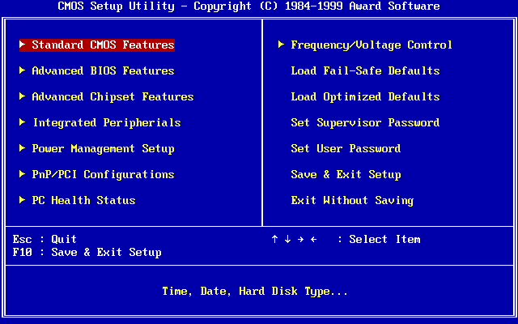
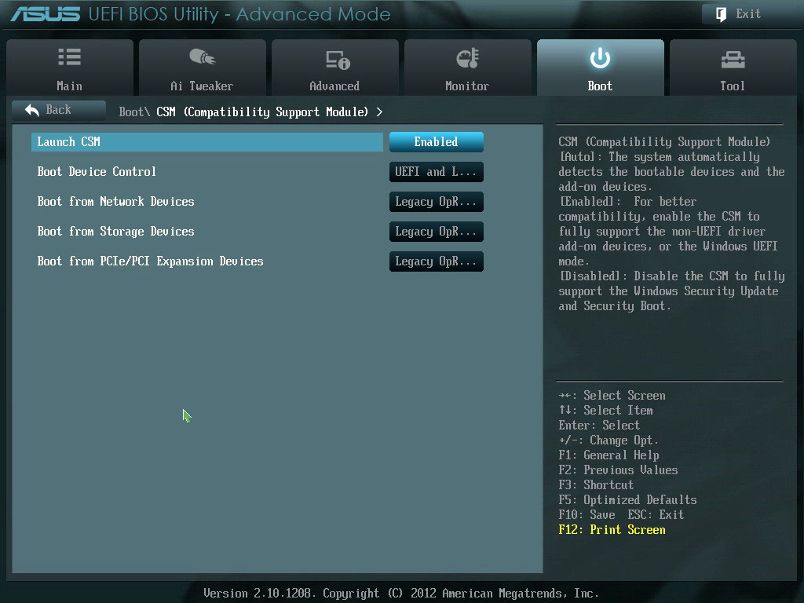

# 计算机是如何启动的

最近在安装操作系统，好奇计算机是如何启动的。查阅了一些文章和资料，粗略了解了从按下开机键到整个操作系统完成启动的过程。

## boot 的含义

计算机启动的英文单词为 boot，是 bootstrap 的缩写, bootstrap 的本意是靴子，启动的含义来自一个习语：

> Pull oneself up by one's bootstraps。（通过提靴子把自己拉起来）

这看起来像是不可能的事。不过，计算机的启动过程就是这样，不借助外界的帮助，自己就把自己启动了。

关机时，计算机的 CPU 是死的，内存也是空的，它需要执行一系列的动作，从硬盘中找到操作系统所在的位置，并启动它。

## TL;DR

整个启动过程大致可以分为如下几步：

1. 前提：硬件通电。
2. 预启动：CPU 载入主板上的 BIOS/UEFI 固件，执行 POST 检查。
3. 启动引导：BIOS/UEFI 根据预设的启动设备优先队列，从第一个可启动设备的 MBR 扇区或 EFI 分区读取启动引导程序，运行引导程序，由引导程序启动操作系统内核。
4. 操作系统初始化，启动完成。

下面是一些细节补充。

## 硬件通电

没什么好说的，就是电源进行供电转换,给各个硬件通电。这个过程也被称为上电(boot up)。

## CPU 初始化

通电后，主板向 CPU 发出复位信号，CPU 进行初始化, 把指针、寄存器等状态复位。

CPU 完成初始化之后，会从特定的一个物理地址开始执行。以 Intel 80386 为例，这个地址是 `0xFFFFFFF0`，对应的是一条跳转指令，跳转到 BIOS 程序起点。

## BIOS

如果你的电脑遇到过启动问题，你应该就对 BIOS 不陌生。因为电计算机启动的第一个重要角色就是 BIOS。

BIOS 全名 Basic Input/Ouput System, 中文为 “基本输入输出系统”。

BIOS 是一个预装在主板上的固件，它在通电启动阶段执行硬件的初始化和检测，并为操作系统提供运行时服务。

BIOS 与主板是绑定的。早年的 BIOS 写在只读存储（ROM）上，不能更新。现在，大部分存储在闪存上，可以通过特定方式更新，不过，对一般用户，并不需要更新 BIOS。

## 加电自检

启动前，BIOS 固件会先进行计算机硬件检查、测试和初始化，这个过程称为加电自检（Power-On Self-Test,POST）或上电自检。

开机自检包括 CPU、内存、主板、显卡、硬盘等设备的检查。

如果自检失败，主板上的蜂鸣器会发出蜂鸣，提示开机错误，启动终止。不同的错误，可能会发出长短、次数不同的蜂鸣声，这些蜂鸣声也被称为自检错误码。

只有自检通过了才会进入启动流程。

## 启动引导

启动引导的过程就是从存储设备中找到操作系统并启动它。

计算机上会存在多个存储设备，比如内置的硬盘、磁盘，外接的 U 盘、CD 等（下面以硬盘为例）。那么，如何从这些设备中找到操作系统呢？

### 启动列表

首先，需要确定从哪个设备启动。

BIOS 上存在一个启动设备的优先列表（boot sequence），每次开机时，BIOS 会从最高优先级的设备开始，读取设备的主引导记录，检查它是不是一个可启动设备，如果是，则从该设备启动，如果不是，则检查列表中的下一个设备。

绝大部分计算机允许用户修改启动列表，用户可以决定优先从哪个设备启动。

### 主引导分区

上面说到，BIOS 会读取存储设备的主引导记录。

主引导记录（Master Boot Record，MBR）位于硬盘的第一个扇区，也称主引导扇区，记录着这个硬盘最重要的信息，主要包括启动信息和分区表。

MBR 总共 512 字节，由 3 大部分组成：

- 启动代码（第 1-446 字节）：如果这是一个可启动设备，将执行这些代码，启动操作系统。
- 分区表（第 447-510 字节）：共 64 个字节，含有 4 条分区记录，每条 16 个字节。分区记录上含有硬盘分区的相关信息，其中第 1 个字节是状态标志，如果是 0x80，就表示该分区是激活分区，一个硬盘只能存在一个激活分区。
- 启动签名（第 511-512 个字节）：结束标志，如果是 0x55AA，表示该硬盘是可启动设备。

有些上下文中，MBR 也特指第一部分的启动代码。这部分代码是跟操作系统相关的，在安装操作系统时写入。

### 启动操作系统

BIOS 通过启动签名判断设备是否可启动，如果可启动，就把 MBR 中的启动代码载入内存执行。

启动代码根据分区表找到激活分区，并执行激活分区上卷引导记录（VBR）的启动代码。VBR 可以看做下一级的 MBR，存在于分区内。

到 VBR 的启动代码，已经足够能找到操作系统的位置并启动操作系统内核了。

## 操作系统初始化

操作系统内核被载入内存后，会执行启动初始化。

以 Linux 为例，会先把 /boot 目录下的内核载入内存，并启动 init 进程。init 负责对系统进行初始化，加载系统的其他模块、服务和应用。

## 一些其他情况

### 启动引导程序

有些程序可以用于辅助引导操作系统，或者实现多系统启动（multi-boot），比如 Linux 使用的 [GRUB](https://www.gnu.org/software/grub/)
。这种情况下，MBR 存储的就不是操作系统的引导代码，而是引导程序的启动代码，然后由引导程序去负责操作系统引导。

同理，安装程序也是把安装程序的启动代码写在了 MBR。

### UEFI 启动

我想说，其实，上文的说法都是过时的，属于十年前的东西了。现代 PC 都使用 UEFI 作为启动固件，取代了 BIOS 的地位。BIOS + MBR 被说成遗留（legacy）方式。

在现代 PC 中，BIOS 已经被 UEFI (Unified Extensible Firmware Interface) 取代了。

相比 BIOS，UEFI 有很多优点：

- 使用 [GPT](https://en.wikipedia.org/wiki/GUID_Partition_Table)(GUID Partition Table)分区表，能够支持 2T 以上的硬盘，和 4 个以上主分区，这些都是 MBR 分区表无法做到的。
- 启动速度更快。
- 安全。
- 可联网。
- 图形化界面和鼠标操作。

不过，二者在启动过程中扮演的角色相近的。所以上文中，我还是以更令人熟悉的 BIOS 进行说明。

UEFI 的引导过程与 BIOS 不同，但大致思想相近，先进行硬件、固件的检测和初始化，加载启动引导程序，再加载操作系统。不过，UEFI 读取的分区是 [EFI(ESP)](https://en.wikipedia.org/wiki/EFI_system_partition) 分区。

EFI 分区没有 MBR 那样严格的限制，包括：

- 分区大小：一般是 100-500MB，这样能直接放下大部分引导程序。
- 物理位置：可以在硬盘的任意位置。

UEFI 也兼容了 MBR 的启动方式，即所谓的 CMS 模式(Compatibility Support Module)。

不过，到目前为止，大家似乎都习惯 BIOS 的说法了。很多时候，说 BIOS，实际上指的是 UEFI 了。
